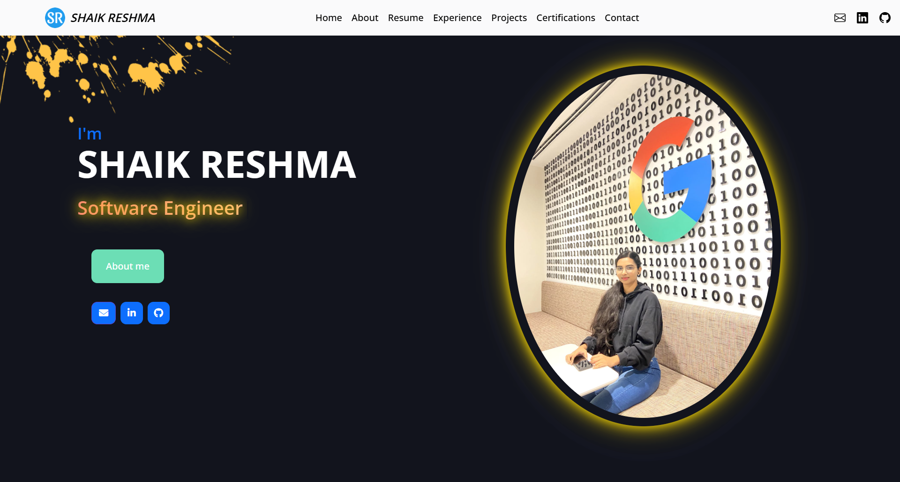

# 💼 Reshma-S-K.github.io

This is my personal portfolio website, built using HTML, CSS, bootstrap and JavaScript.

It showcases my projects, skills, resume, and contact information in a responsive, clean, and professional design.

---

## 🌐 Live Demo

[Click here to view ](https://reshma-s-k.github.io/)

---

## 🚀 Features

- Responsive design for mobile, tablet, and desktop
- Smooth scrolling and animated sections
- Downloadable resume
- Project portfolio section
- Contact form and embedded map
- Social media and email links

---

## 📁 Project Structure 
```
Reshma-S-K/
|   .gitattributes
|   about.html
|   certificates.html
|   contact.html
|   experience.html
|   favicon.ico
|   index.html                        # Main homepage to open the template in the browser
|   projects.html
|   README.md                         # Project documentation
|   resume.html
|   SR_Resume.pdf
+---css                               # CSS framework
+---img                               # images required for the template
+---js                                # JS files
+---lib
|   +---animate
|   +---counterup
|   +---easing
|   +---isotope
|   +---lightbox
|   |   +---css
|   |   +---images
|   |   \---js
|   +---owlcarousel
|   |   \---assets
|   +---typed
|   +---waypoints
|   \---wow
\---scss
    \---bootstrap
        \---scss
            +---forms
            +---helpers
            +---mixins
            +---utilities
            \---vendor        
```
---
## 📸 A Glimpse Into My Potfolio Website 



### 📫 Contact 
Feel free to reach out via the contact form on the site or email me at :  
[](https://www.linkedin.com/in/shaik-reshma-5ab0b6286)
[](https://github.com/Reshma-S-K)
[](mailto:reshmashaik2111@gmail.com)
